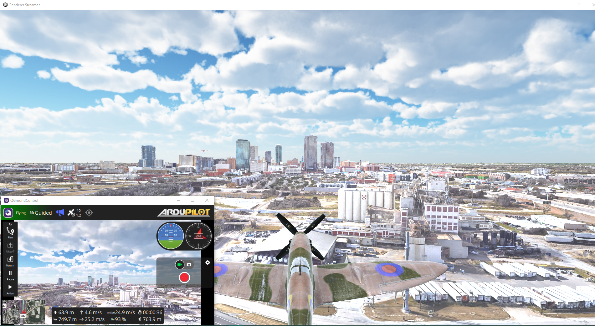
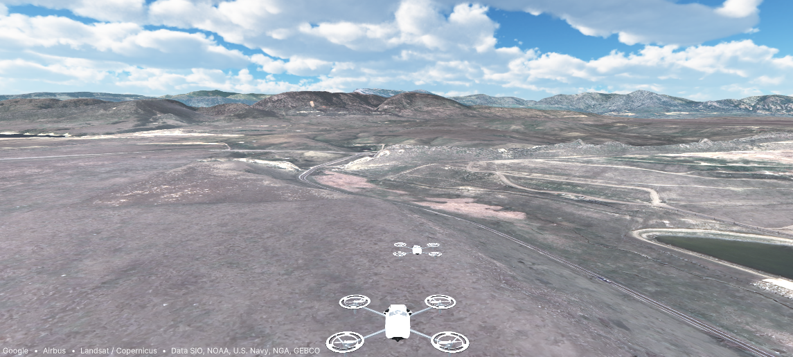
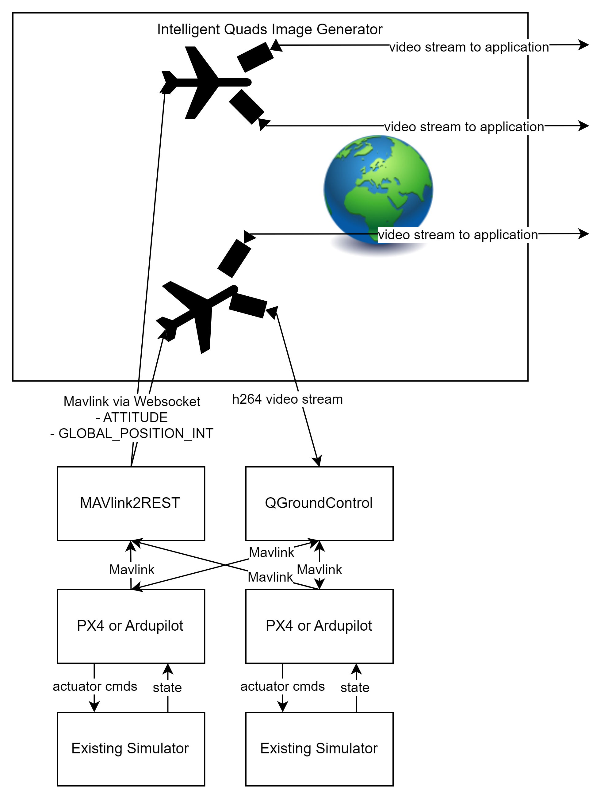

# Intelligent Quads Image Generator

Over the years I have noticed it difficult to simulate camera streams on simulated drones at geo-specific locations. In addition, existing options for geo-specific image generation are tied to simulators. This project aims to only handle the image generation portion of drone simulation. Because of this, the project is extensible, distributable and usable with any existing PX4 or Ardupilot drone simulator. 




## What is an Image Generator?

An image generator is a application that can perform rendering of perspectives in distributed simulations. This is a common approach in professional aerospace flight simulators. For example in a large projector flight simulator room, the resolution of the view may be too high for a single computer to render. In this case, image generators are deployed to multiple computers which are in charge of rendering portions of the view.

## Intelligent Quads Image Generator Architecture



## Image Generator in Action

[Demo Video 1: Plane and Copter](https://drive.google.com/file/d/1C7zh7yaCywoVYKrR8HzJPFbLfvuoXEst/view?usp=sharing)
[Demo Video 2: Ardupilot Follow Mode](https://drive.google.com/file/d/179BizkFQe_oQkucMbuEu0llfekSWWDEe/view?usp=sharing)

## Underlying Technology

This project leverages Cesium for unity to bring geo-specific 3d map tiles into Unity. I have currently elected to use Google Maps as my 3d map tile provider. The map tile provider may be configurable in the future. The project then leverages FFmpeg to create video streams from the Unity cameras. The location of aircraft are brought into Unity using a websocket connection to a mavlink2REST server. 

### Technology Justification

- **Game Engine**: I considered using Unreal Engine, or GoDot as an alternative to Unity. Unreal would have worked just as well, however I am more familiar with unity and feel like the environment is easier to use. I did look at goDot, which would have been good because it would have alieviated licensing concerns some organizations will likely have with Unity. However, Godot did not have a Ceisum plugin and I did not want to write one.

- **Aircraft State Data Interface**: [Mavlink2REST](https://github.com/mavlink/mavlink2rest) While I could have used mavlink directly over UDP or TCP, I elected to use MAVLink2REST, because it allows for mavlink over websockets, which will allow for TLS encryption and enable the mavlink data to sit behind a reverse proxy, such as in the [Intelligent Quads Cloud Simulator](https://www.intelligentquads.com)


## Project Goals

- [x] Use 3d Map tiles to be able to have 3d image generation from any where in the world
- [x] generate udp h264 video streams from unity cameras
- [x] support multiple aircraft
- [x] create configuration file system to be able to configure
    - [x] number of cameras
    - [x] camera settings
    - [ ] aircraft meshs 
    - [ ] surface deflections and prop rotations
- [ ] in game menus for configuring settings
- [ ] modelling of mavlink based gimbal control
- [ ] load in custom aircraft meshes
- [ ] add ground clipping system to allow ground vehicles to move across the terrain
- [ ] support multiple map tile providers
- [ ] Set time of day
- [ ] Set weather conditions
- [ ] Some amount of world customization


## Using the Image Generator

- generate a maps API key from google. follow this [tutorial](https://youtu.be/u6wW5ZIIrpc?si=m64pGFGyKjVAmcvR&t=100) 
- Download the latest release from the [releases page](https://github.com/ericjohnson97/iq_image_generator/releases)
- unzip the release
- copy the file `config.json.example` to `config.json`
- configure the `config.json` file in the `Intelligent Quads Image Generator_Data/StreamingAssets` folder
    - set the `"tileURL"`:  to `https://tile.googleapis.com/v1/3dtiles/root.json?key=<your google maps api key>`
    - set the `"mavlink2RestURL"` to a mavlink2rest server. if using inteligentquads.com as the sim backend set it to `"wss://sim.intelligentquads.com/<uuid>"` if using the [example simulation](#Example-Simulation) set it to `"ws://127.0.0.1:6040"`


### Configuration File

The Image generator loads the file `config.json` from the `Intelligent Quads Image Generator_Data/StreamingAssets` folder. The configuration file is a json file that allows you to configure cameras for each aircraft in the simulation. 

here id an example config file

```json
{
    "tileURL": "https://tile.googleapis.com/v1/3dtiles/root.json?key=<YOUR_API_KEY>",
    "mavlink2RestURL" : "ws://127.0.0.1:6040",
    "vehicles" : [
        {
            "id" : 1,
            "cameras" : [
                {
                    "id": 1,
                    "position" : [3, 0, 0],
                    "orientation" : [0, 0, 0],
                    "vFOV" : 26,
                    "streamingEnabled" : "false",
                    "encoding" : "H264Nvidia",
                    "destination" : "udp://192.168.1.255:5600"
                },
                {
                    "id": 2,
                    "position" : [3, 0, 0],
                    "orientation" : [0, -90, 0],
                    "vFOV" : 26,
                    "streamingEnabled" : "false",
                    "encoding" : "H264Nvidia",
                    "destination" : "udp://192.168.1.255:5601"
                }
            ]
        },
        {
            "id" : 2,
            "cameras" : [
                {
                    "id": 1,
                    "position" : [3, 0, 0],
                    "orientation" : [0, 0, 90],
                    "vFOV" : 26,
                    "streamingEnabled" : "false",
                    "encoding" : "H264Nvidia",
                    "destination" : "udp://192.168.1.255:5610"
                }
            ]
        }
    ]

}
```

cameras will automatically spawn on aircraft based on the number of cameras in each of the cameras arrays.

**Note**: there does not need to be entry for each aircraft in the simulation. Aircraft are spawned into the world via their mavlink heartbeat. The simulation will automatically spawn an aircraft mesh based on their vehicle type in the heartbeat message. If you would like an aircraft to have a camera attached to it you must add an entry for that aircraft in the `vehicles` array with the associated camera configuration. 

### Game Controls

- Use `c` to cycle through follow cameras
- follow cameras can be repositioned by using `wasd` and scroll wheel
- press `esc` to bring up menu. **Note** menu is not yet functional


## Example Simulation

This project provides a simulation environments in a docker compose file. There is an environment provided for ArduCopter and ArduPlane. The compose file uses docker compose profiles to allow you to choose which vehicle you want to simulate. The available profiles are  `arducopter` and `arduplane`. You can run a simulation environment by running the following command:

```
docker-compose -f sim.yml --profile arducopter up
```

Assuming you have run the `bun run dev --host` command, you can access the simulation environment by opening the browser and accessing `localhost:5173`.

**Note**: I usually run my simulator on a virtual machine with a bridged network adapter. This should work in WSL, but I have not tested it.

## Developer Setup

### Linux

- clone unity project 
- run 
```bash
git submodule update --init --recursive
```

**Install dependancies and build Cesium-unity**
These instructions are based on this document 
https://github.com/CesiumGS/cesium-unity/blob/main/Documentation~/developer-setup.md

I am using the following packages and versions for ubuntu 22.04
- cmake 3.29.3
- dotnet-sdk 8.0
- nasm 2.15.05

**Before you open the unity project for the first time** run the following
```
cd Packages/com.cesium.unity/
dotnet publish Reinterop~ -o .
```

Then open the project in Unity. After the porject has been opened you should see this error
```
DllNotFoundException: CesiumForUnityNative assembly:<unknown assembly> type:<unknown type> member:(null)
NotImplementedException: The native implementation is missing so OnValidate cannot be invoked.
```

Now we must build unity-native
```
cd Packages/com.cesium.unity/native~
cmake -B build -S . -DCMAKE_BUILD_TYPE=Debug
cmake --build build -j14 --target install --config Debug

```
The `-j14` tells CMake to build using 14 threads. A higher or lower number may be more suitable for your system.

Once this build/install completes, Cesium for Unity should work the next time Unity loads Cesium for Unity. You can get it to do so by either restarting the Editor, or by making a small change to any Cesium for Unity script (.cs) file in `Packages/com.cesium.unity/Runtime`

**Building and Running Game**

When you build and run a standalone game (i.e. with File -> Build Settings... or File -> Build and Run in the Unity Editor), Unity will automatically compile Cesium for Unity for the target platform. Then, by hooking into Unity build events, Cesium for Unity will build the corresponding native code for that platform by running CMake on the command-line. This can take a few minutes, and during that time Unity's progress bar will display a message stating the location of the build log file.

You can view progress by running the following

Replace build-Standalone with the name of the log file from the progress window.

Or on Linux or macOS:
```
cd cesium-unity-samples/Packages/com.cesium.unity
tail -f native~/build-Standalone/build.log
```

## Windows


## FAQ

### Are you planning on making this image generator CIGI compliant?

I am not planning on adding [CIGI](https://en.wikipedia.org/wiki/Common_Image_Generator_Interface) support to this project, because I do not have an immediate need for it. However, I am open to pull requests that add CIGI support.
